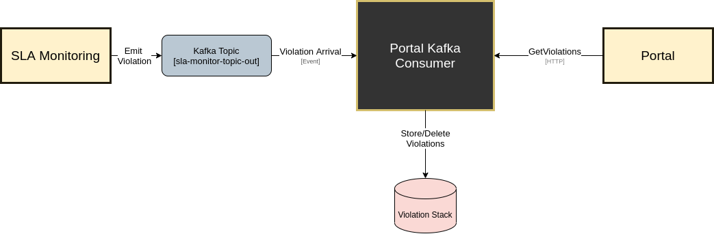

# Portal Kafka Consumer
This repository contains the code for the consumer required to pass the notifcations from the SLA-Monitoring to the Portal Frontend.

## Architecture
The following subchapter aims to explain the architecture designed and its implications.


 
### Components
- Portal is currently a Frontend developed in React with no direct Backend connection.   
- Database present in the image serves as a stack for violations that have yet to notify the Portal. As they arrive, they are added to the stack and once they have been read, bundled and sent to the Portal, they are deleted so as not to notify the portal more than once for each violation.
- SLA-Monitoring and overall 5GZorro microservice, asynchronous nature, made use of the Datalake developed to store all information so that components are not synchronously connected to each other. The SLA-Monitoring abstractly treats SLA data as events and stores the violations on a Kafka topic. 

**Issue**  
Consequently, this event based nature, means that the correct way for components to receive notifications about the violations is to subscribe to that specific topic and therefore receive events as they are created in the SLA-Monitoring.
Given that in addition to this, the Portal has no backend, it becomes hard for the Frontend to consume the violations as they occur in real-time. 

**Choices**  
The possible solutions we looked at were:
1. Creating a Websocket channel between the Portal and SLA-Monitoring
2. Creating a middleware component that subscribes to the topic and passes the information to the Portal  
   a. Information sent via Websockets (Async)  
   b. Information sent via a queryable endpoint (Sync)

**Solution**  
First and foremost, we immediately discarded option 1. since the SLA-Monitoring should remain as abstracted as possible to other components and this implies not creating direct dependencies to any component.  
Looking at option 2, the best approach would be to receive violations via subscription to the topic and send them to react via Websockets, however, given that this approach would be way more complex and time-consuming than enabling a queryable endpoint, we decided to go with **2.a.**   
This approach implies having an asynchronous task in React with a Hearbeat that sends requests to this Portal Kafka Consumer component every X seconds to verify if a violation has occured.  
While this makes the notifications not real-time, given a short, frequent heartbeat, the difference should be almost unnoticeable.


### Input
Violation Example:
```
{
  "id": "9b1deb4d-3b7d-4bad-9bdd-2b0d7b3dcb6d", 
  "productID": "9b1deb4d-3b7d-4bad-9bdd-2b0d7b3dcb6d",
  "sla": {
    "id": "9b1deb4d-3b7d-4bad-9bdd-2b0d7b3dcb6d", 
    "href": "http://www.acme.com/slaManagement/sla/123444"
  },
  "rule": {
    "id": "availability",
    "metric": "http://www.provider.com/metrics/availability",
    "unit": "%",
    "referenceValue": "99.95",
    "operator": ".ge",
    "tolerance": "0.05",
    "consequence": "http://www.provider.com/contract/claus/30"
  },
  "violation": {
    "actualValue": "90.0"
  }
}
```


## How To Run
To locally test/run using docker, run the following [script](run.sh) which uses docker-compose to run everything. 

To deploy, build the image and upload to private registry using the [script](k8s.sh) provided. Additionally, the Kubernetes files needed to deploy are also provided in the k8s/ folder.